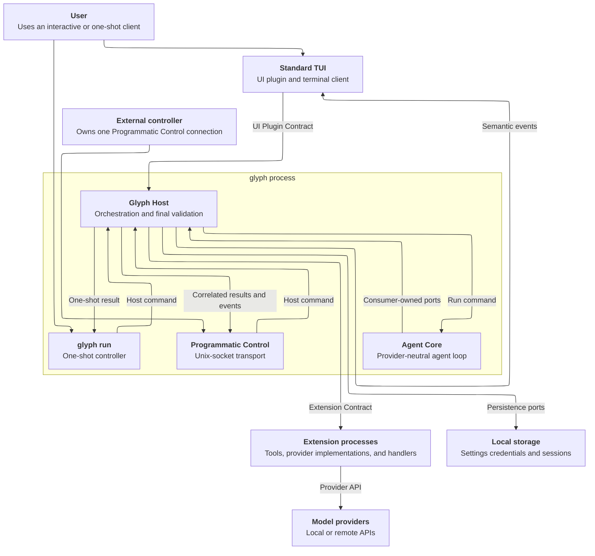

# Architecture: Glyph target product

## Architectural Goals and Constraints

- GOL-01: Keep Agent Core limited to provider-neutral agent-loop behavior that every Glyph agent needs.
- GOL-02: Extend model, tool, session, context, and client behavior through Host-managed plugins without exposing plugin transport to Agent Core.
- GOL-03: Keep one authoritative owner for every state transition and public contract.
- CNS-01: `glyph` contains Glyph Host and Agent Core in one process. Agent Core is a logical component, not an executable, daemon, repository root, or plugin.
- CNS-02: Extension and UI plugins run as separate local processes. Programmatic Control runs inside `glyph` and accepts one external controller through a Unix socket.
- CNS-03: Agent Core imports no protobuf, gRPC, plugin SDK, persistence adapter, provider SDK, settings, credential, UI plugin, or standard TUI package.
- CNS-04: Glyph has no Pi source, API, configuration, session, or extension compatibility requirement.
- CNS-05: Each internal Go interface and its method types belong to the consuming package.
- CNS-06: Public process contracts use provider-neutral and client-neutral data. Host persistence and the owning provider implementation handle provider credentials and provider reasoning context through provider-scoped operations. Glyph clients and non-provider extension operations never receive them.
- CNS-07: Glyph remains one Go module and supports macOS and Linux. Project-root `internal` directories enforce source ownership inside the module.
- CNS-08: Glyph requires no backward compatibility with prototype contracts or earlier target-contract revisions.
- CNS-09: This architecture assigns package paths only to implemented components. The owning phase Technical Solution shall select package placement before implementing a new component.
- CNS-10: The standard TUI owns terminal initialization, modes, and cleanup. Host does not inspect, snapshot, reset, or restore terminal state and does not restart a terminated TUI.
- CNS-11: Extension runtime management owns process mechanics and runtime availability. The Host use case that consumes an extension capability owns that capability's policy, handler ordering, validation, state transitions, and public error meaning.

## Key definitions and abbreviations

- DEF-01: Glyph Host. The logical orchestration component inside `glyph` that owns plugins, providers, sessions, clients, extension dispatch, validation, and persistence coordination.
- DEF-02: Agent Core. The UI-free logical component inside `glyph` that owns one agent run, the provider-neutral model and tool loop, run state, and agent lifecycle events.
- DEF-03: Glyph client. A UI plugin or programmatic controller that sends Host commands and receives Host events.
- DEF-04: Extension operation state. One immutable original value and one current value passed through handlers in deterministic registration order.
- DEF-05: Branch summarization. Creation of a `BranchSummaryEntry` for entries left behind by session-tree navigation.
- DEF-06: Logical component. A responsibility boundary that can span several Go packages without creating a process boundary.
- DEF-07: Project root. A repository directory with its own command, nested `internal` packages, and composition root.
- DEF-08: Observer extension point. A notification whose handlers cannot change or stop the observed operation.
- DEF-09: Transformer extension point. An ordered handler chain that applies DEF-04 without replacing the complete operation result.
- DEF-10: Gate extension point. An ordered handler chain that can allow or reject one operation but cannot provide its result.
- DEF-11: Replaceable extension operation. An operation whose handlers can provide a complete result and skip its built-in implementation.

## System Context

- CTX-01: A user controls `glyph` through one selected UI plugin or one-shot `glyph run`. An external programmatic controller uses Programmatic Control. All three paths invoke Host use cases and receive the same semantic outcomes.
- CTX-02: Glyph Host starts and supervises extension and UI plugin processes, resolves registered providers, coordinates Agent Core dependencies, and persists settings-owned state and sessions.
- CTX-03: Agent Core requests effective context, one logical model execution, tool execution, history changes, and event delivery through consumer-owned Go interfaces. Host adapters satisfy those interfaces.
- CTX-04: Provider extensions communicate with local or remote model providers. Provider wire formats, authentication, and response classification remain inside the owning provider extension. Host owns retry coordination outside Agent Core.
- CTX-05: Extension and UI plugin processes share no Host `internal` package. They use only their public process contracts and SDK packages.

## Solution Overview

- SOL-01: Host controllers validate external commands and invoke Host use cases. Host use cases coordinate extension handlers, validate the final state, and call Agent Core or infrastructure only after validation succeeds.
- SOL-02: Agent Core runs one provider-neutral loop. It asks Host adapters for effective context, model execution, and tool execution, then applies terminal results to the active run.
- SOL-03: Every transforming extension point starts with equal original and current values. Each handler receives the immutable original value and the current value from preceding handlers. Invalid actions and ordinary handler errors preserve the received current value for later handlers.
- SOL-04: For a replaceable extension operation, built-in behavior runs only when its handlers end without an extension-provided result. Observers, transformers, and gates have no result-based fallback. Host validates every final result before state commit, persistence, or infrastructure dispatch.
- SOL-05: Each Host capability use case owns its extension-handler ordering and final validation. Extension runtime management owns process lifecycle, transport mapping, availability, and low-level invocation without owning capability policy. Agent Core receives only the minimum provider-neutral contracts required by its loop.

## Components

- CMP-01: Glyph application assembly. `host/cmd/glyph` selects the application mode. `host/internal/app` loads configuration and wires concrete Host, Agent Core, controller, and infrastructure services. It owns no business behavior. Session storage initializes before dependent provider work. Assembly binds the actual provider catalogue directly at sessions and sessiontree before runtime activation.
- CMP-02: Client and command controllers. `host/internal/controller/ui`, `host/internal/controller/programmatic`, and `host/internal/controller/cli/headless` own external input and consumer-owned Host command contracts. UI and Programmatic controllers own command-operation lifecycles. `host/internal/infra/plugins/ui/runtime`, `host/internal/infra/programmatic/output`, and `host/internal/infra/headless` own concrete mode output. UI and Programmatic operation output and unsolicited output share one ordered writer per connection. UI output owns startup reporting, initialization content, selection warnings and their stderr fallback, and provider authorization presentation. The completed startup report is authoritative; incremental issue reports do not create duplicate initialization items. Successful initialization delivers pending selection warnings once. Output close attempts only pending warnings and returns complete writer failures. The browser adapter implements the UI output consumer's browser contract. Host UI supplies model/session initialization facts and invokes its runtime-activation port only after the controller attaches the initialized output writer and failure owner. Authentication starts asynchronously; shutdown cancels and joins it.
- CMP-03: Host operation orchestration. `host/internal/usecase/host/runcontrol` owns run identifiers, prepared reservations, Core invocation, and settlement ordering. `host/internal/usecase/host/events` owns client-first dispatch and subsequent lifecycle observation. Run control consumes execution and settlement contracts, not Core state snapshots. `host/internal/usecase/host/operationgate` directly implements the admission contracts consumed by run control, Host UI, and Host Programmatic. `host/internal/usecase/host/startup` coordinates implemented extension registration. Other Host use cases own model selection, session commands, extension coordination, and environment reload.
- CMP-04: Agent Core. `host/internal/usecase/agent/run` owns the run state machine, model and tool loop, ordered agent events, cancellation, and terminal run outcome. Core directly implements run control's execution and settlement contract. Its execution result reports whether the run entered awaiting-settlement state, including cancellation before the first history append. A failed begin reports no settlement transition. Core's outgoing interfaces describe effective context, logical model execution, tools, history, and event delivery.
- CMP-05: Extension runtime management. `host/internal/usecase/host/extensionruntime` owns implemented extension discovery, process startup, registration state, runtime generation, availability, low-level operation invocation, monitoring, cancellation, and shutdown. It implements consumer-owned invocation interfaces and owns no tool, session, selection, model-execution, command, resource, or client-delivery policy. `host/internal/infra/plugins/extension` owns implemented process startup, gRPC mapping, and process shutdown. Filesystem catalogues return executable observations and filesystem failures. Runtime management owns extension directory acceptance and duplicate exclusion; Host UI selection owns whole-catalogue rejection and selected-candidate/probe policy. Runtime management owns process registration and invocation representations. It attaches discovered identity to decoded declarations and projects domain entries and lifecycle facts before transport encoding. Process payloads contain neither provider replay context nor hidden extension bytes. Capability owners retain handler acceptance, composition, and observation policy. Mode outputs directly implement runtime-failure reporting.
- CMP-06: Model subsystem. `host/internal/usecase/host/providers` owns the implemented provider catalogue, provider-neutral model descriptors, active model selection, reasoning choice, credential preflight, and atomic selection commit. The logical Host provider-authentication component owns the client-neutral operation that starts or retries authentication for one configured provider. The logical Host model-execution component owns provider dispatch, provider middleware, retry decisions, and terminal model-call results.
- CMP-07: Session subsystem. `host/internal/domain/session` owns shared session information, entries, trees, and accounting values. `host/internal/usecase/host/sessions` owns active state, incarnation, history projection, durable mutations, and committed-entry publication. Host UI and Host Programmatic own their active-session and navigation contracts, stored-list results, and public response projections. Sessions implements their state and history queries directly. `host/internal/usecase/host/sessiontree` implements their navigation contracts and owns handler policy, summarization, final validation, and its outgoing atomic commit contract. The logical Host compaction component owns context compaction.
- CMP-08: Tool subsystem. `host/internal/usecase/host/tools` owns the implemented active tool registry, tool conflict policy, tool-result semantics, and tool-to-runtime ownership. The logical Host tool component also owns future tool middleware coordination. It invokes extension processes through its consumer-owned runtime interface. Agent Core sees only its consumer-owned tool interface.
- CMP-09: Bundled provider extensions. The OpenAI Codex and OpenAI-compatible provider implementations run as ordinary extension processes and own authentication, wire request serialization, response streaming, retryable failure classification, usage mapping, and provider reasoning context replay. Host contains no concrete provider implementation.
- CMP-10: Persistence subsystem. `host/internal/infra/persistence` owns settings loading, credentials, session storage, filesystem paths, file permissions, and atomic adapter operations. The session repository selects and validates the version-2 file schema. Domain session headers carry identity and metadata, not a storage-version selector. Persistence packages implement use-case-owned interfaces and contain no Host orchestration.
- CMP-11: Programmatic Control transport. `api/programmatic/v1`, `pkg/programmatic/v1`, `host/internal/controller/programmatic`, `host/internal/infra/programmatic/output`, and `host/internal/infra/programmatic/socket` expose Host commands and events through bidirectional gRPC over a Unix socket inside `glyph`. The output implementation owns the single active run/output association. Prepared Host work owns execution, and Core implements the Host consumer's minimal activity query.
- CMP-12: Extension public boundary. `api/plugins/extension/v1`, `pkg/plugins/extension/v1`, and `sdk/plugins/extension/v1` define and support the Host-owned extension process contract without exposing Host or Agent Core internal types.
- CMP-13: UI plugin public boundary. `api/plugins/ui/v1`, `pkg/plugins/ui/v1`, and `sdk/plugins/ui/v1` define and support the Host-owned UI plugin process contract.
- CMP-14: Standard tools extension. `plugins/extension/tools` implements bundled coding tools as an ordinary extension process and owns its tool use cases, filesystem adapters, process adapters, and composition. Its extension controller parses and validates bash input and owns the consumed command contract. The bash usecase owns execution timers, timeout causes, and cancellation cleanup. The process adapter owns process groups, termination, output streaming, and output spill.
- CMP-15: Bundled resource extension. This logical extension converts collected skills and context files into resolved instructions and model context and exposes prompt templates through Host. Agent Core receives no resource types.
- CMP-16: Standard TUI. `plugins/ui/tui` owns client interaction and rendering, not agent execution or authoritative session state. The presentation usecase owns private display/interaction state, pending-command policy, and its transitions. Input controllers decode Host notifications and terminal input. SDK infrastructure owns connection binding and command/notification I/O; terminal infrastructure owns Bubble Tea, terminal resources, geometry, and rendering. Tree visibility and selection rules remain with application state. The [TUI solution](phases/07.1-architecture-audit-and-correction/solution.md#tui) defines the paths and contracts. Terminal runtime consumes device/file ports implemented by `infra/terminal/device`. Projection mutations invalidate detached display data; editor-only transitions reuse it. The [TUI ownership record](phases/07.1-architecture-audit-and-correction/tui-ownership-gap.md) closes BLK-01 through BLK-04 and keeps the separately approved persistence-cause correction open.

## Component diagram



- DGM-01: Solid arrows show runtime call, result, or event direction. The `Core` to `Host` edge represents interfaces declared at the Agent Core use site and implemented by Host adapters.
- DGM-02: The `glyph process` boundary contains Programmatic Control and the one-shot controller. Standard TUI and the external programmatic controller are Glyph clients outside that process.

## Overengineering and Overspecification Considerations

The architecture keeps one `glyph` process and separate project roots for Host and plugin executables. It adds no Agent Core executable, Host daemon, message broker, shared plugin renderer, provider override mechanism outside the ordinary extension lifecycle, extension-triggered environment reload, or compatibility layer. Package paths are recorded only for implemented components; a phase Technical Solution selects placement for each new component before implementation.

## Folder structure

```txt
- api/ - existing public protobuf sources
  - plugins/extension/v1/ - existing Extension Contract source
  - plugins/ui/v1/ - existing UI Plugin Contract source
  - programmatic/v1/ - existing Programmatic Control source
- pkg/ - existing generated public Go contracts
  - plugins/extension/v1/
  - plugins/ui/v1/
  - programmatic/v1/
- sdk/ - existing handwritten plugin bootstrap SDKs
  - plugins/extension/v1/
  - plugins/ui/v1/
- host/ - existing glyph project root
  - cmd/glyph/ - existing process entry point
  - internal/app/ - existing composition root
  - internal/controller/ - existing CLI UI and Programmatic Control adapters
  - internal/domain/ - existing provider-neutral agent model session and tool models
  - internal/usecase/agent/run/ - existing Agent Core logical component
  - internal/usecase/host/ - existing Host orchestration packages
  - internal/infra/ - existing infrastructure adapters
    - headless/ - one-shot output and diagnostics
    - programmatic/output/ - run-correlated and unsolicited Programmatic output
    - plugins/ui/runtime/ - selected UI process stream and output
- plugins/extension/tools/ - existing bundled tools extension project root
- plugins/ui/tui/ - existing standard TUI project root
  - internal/controller/plugin/ - Host notification and initialization input
  - internal/controller/tui/ - terminal input decoding
  - internal/usecase/presentation/ - private application state and interaction policy
  - internal/infra/host/ - initialized SDK command and notification I/O
  - internal/infra/terminal/ - Bubble Tea runtime, snapshots and rendering
    - device/ - controlling-terminal file acquisition and cleanup
- docs/specs/features/initial/architecture.md - target architecture authority
```

- DGM-03: The tree records implemented placement only. A phase Technical Solution must add a new path to this tree when it selects and implements that path.
## Data Models

- ENT-01: `model.Descriptor` is provider-neutral and Host-owned. It contains provider ID, model ID, reasoning capabilities, tool capabilities, pricing, ordered input modalities, `contextWindow`, and `maxTokens`. Input modalities use the closed values `text` and `image`.
- ENT-02: `model.Selection` contains provider ID, model ID, and reasoning choice. Host commits the three fields atomically after catalogue, capability, and credential validation.
- ENT-03: Extension operation state contains an immutable original request, a current request, an original-result state that is absent until result processing starts, and a current-result state that is absent or contains one result.
- ENT-04: `RetryDecision` contains the provider failure classification, completed attempt count, next-attempt decision, delay, and effective attempt limit for one failed model request.
- ENT-05: A session tree contains parent-linked entries and one active leaf. Entry variants include user messages, model responses, tool results, extension entries, `BranchSummaryEntry`, and compaction entries.
- ENT-06: `BranchSummaryEntry` contains the summary attached by tree navigation, its branch boundary, actual result source, and optional normalized usage and estimated cost under the PRD's [Context and Sessions](prd.md#context-and-sessions) requirements. The result source is independent of the model selected for built-in summarization. The entry is a child of the navigation destination and becomes the active leaf when created.
- ENT-07: A compaction entry contains the final summary and the first preserved active-branch entry identifier. Original session entries remain stored.
- ENT-08: Provider reasoning context contains provider-owned opaque bytes and a source identity. Host passes it only to the owning compatible provider implementation. Glyph clients and non-provider extension operations never receive the payload.

## Programming Interfaces

- APC-01: Agent Core declares its effective-context interface in `host/internal/usecase/agent/run`. A Host adapter implements extension context transformation and session projection without exposing handler count, order, process identity, protobuf, or gRPC.
- APC-02: Agent Core declares its logical model-execution interface in `host/internal/usecase/agent/run`. Host model execution implements provider selection snapshot, middleware, retry coordination, and provider dispatch.
- APC-03: Agent Core declares its tool-runtime interface in `host/internal/usecase/agent/run`. Host tools implement registry lookup, middleware, extension dispatch, and runtime-failure mapping.
- APC-04: Agent Core declares history and event interfaces in `host/internal/usecase/agent/run`. Host session and event adapters implement persistence and client delivery.
- APC-05: Every Host controller package declares the smallest Host interface and method types needed by that controller. Host use cases implement those interfaces.
- APC-06: Every Host use case declares each outbound dependency interface at its use site, including interfaces for Agent Core, repositories, providers, plugin runtimes, clocks, identifiers, and client delivery. Agent Core or infrastructure packages implement those interfaces.
- APC-07: PHS-05.1 removed `host/internal/hooks`. Extension dispatch contracts belong to Host, while Agent Core depends only on APC-01 through APC-04 and does not regain a generic Host hook dependency.
- APC-07.1: Each TUI input controller owns its neutral application contract and payloads; the presentation usecase directly implements both. The usecase owns outgoing Host, display-snapshot, and runtime ports. SDK and terminal adapters implement those ports. Terminal infrastructure owns its consumed notification-source contract. Assertions are directly beneath their implementing structs; input controllers have no dependency on concrete usecases or output adapters.

## Contracts

- APC-08: Programmatic Control is a Host-owned command, acceptance, correlated event, interaction, notification, model catalogue, selection, provider authentication, session, compaction, retry, and queue-control contract. Its supported transport is bidirectional gRPC over a Unix socket.
- APC-09: The UI Plugin Contract is Host-owned. It carries initialization, client commands, semantic events, interactions, notifications, and provider-neutral authentication operations. It exposes no provider-specific authentication command or progress type, terminal-ownership field, or startup-capability RPC. Successful plugin protocol startup establishes UI compatibility. The contract grants no agent orchestration authority.
- APC-10: The Extension Contract is Host-owned. It carries registration, extension contexts, ordered handler requests and results, provider-neutral model access, persisted extension-state recovery, command-initiated session control, tools, resources, commands, events, interactions, notifications, and provider registration and execution for bundled and separately delivered providers. Host owns session data access and state transitions; extensions own interpretation of their stored payloads.
- APC-11: The model-provider contract is declared by the Host model-execution consumer. It carries provider-neutral model requests, streamed semantic output, typed usage, safe diagnostics, retry classification, and opaque provider reasoning context.
- APC-11.1: PHS-06 establishes the Host model-execution consumer and its provider-neutral provider interface. In-process provider adapters implement that interface until PHS-12 replaces them with extension-runtime adapters without changing the Agent Core or Host capability callers.
- APC-12: The settings contract owns configured provider instances and model metadata. Unknown fields, unknown modalities, duplicate modalities, empty modality lists, modality lists without `text`, nonpositive limits, and `maxTokens` greater than `contextWindow` fail settings loading.
- EVC-01: Agent lifecycle events originate from Agent Core. Mode output adds client correlation. The event dispatcher completes client delivery before attempting registered extension observers, even if client delivery fails, and preserves both error causes. After a finished run, run control completes Core settlement, client settled delivery, and settlement observers before releasing admission. Cancellation before execution releases the prepared reservation exactly once.
- EVC-02: `session_before_tree` is the transforming extension point before tree navigation. `session_tree` is emitted only after navigation and any `BranchSummaryEntry` persistence commit.
- EVC-03: Model-selection and reasoning-selection events are emitted only after the complete new `model.Selection` commits.
- EVC-04: Retry, compaction, and extension-handler failures are Host events. Agent Core receives only the logical model execution result required to continue or end its run.

### Import rules

- APC-13: `host/internal/usecase/agent/run` can import its own packages, provider-neutral packages under `host/internal/domain`, and Go or third-party utility packages that expose no Host, transport, persistence, provider, or UI concepts. It can also import Host consumer packages solely to implement their interfaces, use their provider-neutral contract types, and declare compile-time assertions. These contract imports do not by themselves violate logical independence and remain subject to Go's import-cycle checks.
- APC-14: Packages under `host/internal/usecase/host` can import provider-neutral domain packages, controller contract types they implement, and Agent Core port types they implement. A Host use case calls Agent Core or another Host use case only through an interface declared by the calling Host use case.
- APC-15: Packages under `host/internal/infra` can import the use-case contract types they implement and private external SDK types. They cannot contain agent-loop, selection, retry, compaction, session-navigation, or extension-ordering policy.
- APC-16: `host/internal/app` can import concrete implementations from every Host layer to wire them. It cannot define business rules or runtime decision policy.
- APC-17: Each plugin project root can import the matching `pkg/plugins` and `sdk/plugins` contract packages. It cannot import `host/internal` or another project root's nested `internal` packages.
- APC-18: Agent Core must remain independent of concrete Host implementations, Host application state, and Host policy. It cannot import `host/internal/hooks`, `host/internal/infra`, `pkg`, `sdk`, or any package under `plugins`.
- APC-19: Packages under `host/internal/domain` can import the Go standard library and provider-neutral utility packages. They cannot import controller, use-case, infrastructure, public process contract, SDK, or plugin project packages.
- APC-20: Packages under `host/internal/controller` can import their own consumer contracts, provider-neutral domain types, and their external transport types. They cannot import concrete Host use-case or infrastructure implementations.

## Key Behavior

### Primary request and model flow

- STP-01: A Glyph client or one-shot invocation sends a command. Its controller validates transport shape and calls the matching Host use case.
- STP-02: Host applies input extension handlers, final input validation, operation admission, and active-session checks before it starts Agent Core.
- STP-03: Agent Core requests effective model context through APC-01 and submits one logical model request through APC-02.
- STP-04: Host snapshots `model.Selection`, applies provider request handlers, dispatches the request to the extension runtime that owns the selected provider registration, coordinates retries, and returns streamed semantic output to Agent Core. Context handlers have already run once through APC-01.
- STP-05: Agent Core emits ordered lifecycle events, records the terminal model response through APC-04, and either ends the run or enters tool flow.

### Tool flow

- STP-06: Agent Core submits each model-requested tool call through APC-03. Host resolves the active tool, applies ordered pre-execution handlers, validates final input, and calls the owning extension runtime.
- STP-07: Host applies ordered result handlers to the original and current tool result, validates the final result, and returns it to Agent Core. Agent Core preserves source-call order when it adds tool results to the next model request.

### Extension flow

- STP-08: Host creates DEF-04 for each transforming extension point and invokes handlers in registration order.
- STP-09: A handler preserves or replaces the current value from the original value, the current value, or both. An invalid action or ordinary handler error is reported and leaves the received current value in place for the next handler.
- STP-10: Cancellation or rejection stops later handlers and ends only the operation defined by that extension point. Host performs no state commit or infrastructure call after cancellation or rejection.

### Session and branch summarization flow

- STP-11: Host serializes session mutations through the session operation boundary and persists each accepted mutation atomically.
- STP-12: Before tree navigation, Host invokes `session_before_tree` request handlers with the immutable original navigation request, current request, and current branch summarization result state. The result state is absent until a handler or the built-in summarizer produces a result.
- STP-13: When navigation requests branch summarization and request handlers end without a result, Host runs the built-in summarizer on the final current request. Result handlers then transform the immutable original result and current result in order.
- STP-14: Sessiontree validates the final tree target and `BranchSummaryEntry`. Sessions checks the expected active leaf, persists navigation and summary together, updates active state and history, and enqueues the immutable committed tree under one lock. Wire acknowledgement and `session_tree` observers run after commit protection is released. Enqueue failure returns committed metadata and a delivery issue without rollback. Cancellation or invalid final state changes neither the active leaf nor persisted entries.
- STP-14.1: Extension context validates the runtime and active-session incarnation before append. Sessions revalidates the incarnation and holds the runtime commit guard while persisting, updating history, and calling its `EntryPublisher`. Real mode output enqueues the committed entry without rereading session state. Sessions releases the guard and lock before acknowledgement. Delivery failure retains the committed entry in the extension result.

### Compaction flow

- STP-15: Host creates original and current compaction requests for manual, threshold, and overflow-recovery compaction. Request handlers can transform the request, set or clear a result, or cancel compaction.
- STP-16: Host runs the built-in compactor only when request handlers end without a result. Result handlers transform the produced result in order.
- STP-17: Host validates and atomically persists the final compaction entry. Agent Core later receives the compacted model-visible projection through APC-01 while original session entries remain stored.

### Retry flow

- STP-18: A provider extension returns a failure and its provider-owned classification. Host creates an original retry decision from that failure, the configured built-in policy, and the completed attempt count.
- STP-19: Retry handlers receive the immutable original decision and current decision in registration order. They can preserve, replace, or cancel that retry. Cancellation stops later retry handlers.
- STP-20: Host validates the final decision. A retry repeats only the failed model request after the selected delay. It does not repeat completed tools or persist intermediate failed attempts.

### Model-selection flow

- STP-21: A Glyph client or extension requests a model or reasoning change. Host creates an immutable original target selection and an equal current selection.
- STP-22: Ordered selection handlers preserve, replace, or reject the current selection. Rejection stops later selection handlers. An ordinary handler error or invalid action is reported, preserves the current selection received by that handler, and does not stop later handlers or deactivate the extension. Host validates model existence, reasoning capability, and authentication only after the handler chain completes without rejection.
- STP-23: Host commits the complete selection atomically and emits the matching event. A rejected request or failed final validation preserves the preceding active selection and emits no selection event.

### TUI interaction flow

- STP-24: During interaction, the terminal event loop delivers decoded Host notifications and user actions to the presentation application owner. That owner updates private state and produces a coherent immutable display snapshot. Background notification reads and command I/O do not mutate application state.
- STP-25: Rejected resume retains the draft and preceding transcript. Committed navigation progress updates the transcript before terminal navigation metadata supplies exact next input and closes the interaction. Session replacement clears the preceding draft only after Host confirmation. One transition owner preserves these distinct steps.

## Configuration

- CFG-01: `~/.glyph/settings.yaml` owns provider instances, model descriptors, retry defaults, active UI selection, and other Host settings. Loading uses strict field and value validation.
- CFG-02: `~/.glyph/credentials.json` stores provider-owned credentials with user-only access. Settings refer to credential sources and never receive resolved secret values.
- CFG-03: Configured extension state is separate from discovered runtime state. Environment reload applies changed extension, provider, resource, and non-UI settings while preserving the active session.
- CFG-04: Standard TUI themes and key bindings belong to the standard TUI. Agent Core and Host do not interpret terminal presentation configuration.

## Non-Functional Considerations

- NFQ-01: Glyph supports one active agent run, one active session, and at most one UI plugin per `glyph` process. This local-tool capacity avoids distributed coordination.
- NFQ-02: Host commits session, selection, compaction, and branch-navigation state atomically at their owning boundary.
- NFQ-03: Handler order is deterministic. Host never resolves a conflict through an undocumented last-loaded or last-completed winner.
- NFQ-04: Context cancellation reaches provider requests, retry delays, tool calls, plugin RPCs, and client delivery.
- NFQ-05: Structured logs use `log/slog` with context. Logs, events, and diagnostics exclude OAuth tokens, API keys, authorization headers, and provider reasoning payloads. Persisted sessions exclude authentication secrets and retain provider reasoning context only as opaque provider-owned data passed to its owning compatible provider implementation.
- NFQ-06: Public behavior is verified through Programmatic Control for headless scenarios and through the UI Plugin Contract for terminal scenarios. Package-level tests verify consumer-owned interfaces and failure boundaries.
- NFQ-07: TUI state transitions remain serialized by the Bubble Tea event loop. Prepared command work remains asynchronous. The ownership correction adds no application event queue and preserves initialized connection context, foreground cancellation, and resource cleanup.

## Architectural Decisions

- DEC-01: Keep Agent Core inside `glyph`. A separate process would add transport and lifecycle work without isolating a user-owned local component.
- DEC-02: Put extension coordination in Host. This keeps handler ordering, plugin failure mapping, and transport out of Agent Core.
- DEC-03: Use original-and-current composition for every transforming extension point. This permits ordered composition and deliberate replacement without load-order winner semantics.
- DEC-04: Run built-in behavior for a replaceable extension operation only when its handlers provide no result. This gives extensions replacement control without applying result fallback to observers, transformers, or gates.
- DEC-05: Put retry coordination in Host and expose one logical model execution to Agent Core. This keeps policy extensible and prevents retries from repeating completed tools.
- DEC-06: Let the consumer own every internal Go interface. Host adapters implement Agent Core needs instead of making Agent Core import a Host hooks contract.
- DEC-07: Route bundled and separately delivered providers through one extension registration path. When active extensions register the same provider identifier, Host rejects every registration in that duplicate group instead of selecting a load-order winner.
- DEC-08: Keep environment reload user- or client-triggered. Extensions receive no reload operation.
- DEC-09: Give the TUI presentation usecase actual interaction state and transition policy. A forwarding service isolates no behavior; keeping related decisions in controllers permits direct mutation around the reducer. Rendering receives snapshots instead of ownership of application state.

## Architecture Risks

- RSK-01: Host orchestration packages can grow into one dependency hub. Keep extension runtime management separate from model execution, sessions, tools, selection, commands, resources, and client delivery. Each capability use case owns its policy and calls runtime management through a consumer-owned interface.
- RSK-02: A public extension contract can leak Host or provider implementation types. Contract review must reject protobuf fields derived from Host `internal` structs or provider SDK types. Credential and provider reasoning fields are valid only in provider-scoped operations for the owning provider implementation; non-provider extension operations cannot carry them.
- RSK-03: A final extension result can violate session or provider invariants. Host validates the final result immediately before the owning atomic commit or infrastructure call.
- RSK-04: Concurrent model selection and an active model stream can mix state. Each logical model execution uses one immutable selection snapshot, and selection changes affect only later executions.
- RSK-05: Extension-controlled retries can create long runs. Retry events expose every decision and pending delay, and general abort cancels the request or delay.

## Trade-off/technical debt

- TRD-01: One Go module permits atomic contract and implementation changes but provides weaker compile isolation than separate modules. Project-root `internal` directories and import checks enforce the selected boundary.
- TRD-02: Agent Core and Host share provider-neutral domain types inside `host/internal/domain`. This avoids duplicate mapping but requires domain packages to remain free of transport, persistence, provider, and client fields.
- TRD-03: Synchronous event delivery applies client backpressure to an active run. It avoids an application queue and its buffering, loss, and shutdown rules for this local tool.

## Assumptions

- ASM-01: Extensions are trusted local executables running with the Glyph user's operating-system permissions because the product requirements exclude sandboxing and project trust. Process-level tests verify that Host treats extension failure as availability failure rather than a security boundary.
- ASM-02: One user owns one `glyph` process and its local files because Glyph is a local developer tool with one connected Glyph client. Public-contract tests verify one-client process ownership and local file permissions.

## Open Questions

None.

## Standards Deviations

None.

## References

- REF-01: `docs/specs/features/initial/prd.md` defines target product behavior.
- REF-02: `docs/specs/features/initial/delivery-plan.md` defines phase order and dependencies.
- REF-03: `docs/specs/features/initial/phases/00-prototype-baseline/solution.md` records the implemented prototype baseline, not target ownership.
- REF-04: `docs/terms.md` defines project terminology.
- REF-05: `host/internal/usecase/agent/run` is the current Agent Core package group.
- REF-06: `host/internal/usecase/host` is the current Host use-case package group.
- REF-07: `api`, `pkg`, and `sdk` contain the current public process contracts and plugin SDKs.
- REF-08: `docs/specs/features/initial/phases/05.1-extension-boundary-cleanup/solution.md` defines the implemented package ownership that establishes CNS-11 before PHS-07.
- REF-09: [TUI ownership gap](phases/07.1-architecture-audit-and-correction/tui-ownership-gap.md) records corrected TUI ownership and the source-backed closure of all five blockers. [U8 accounting](phases/07.1-architecture-audit-and-correction/u8-evidence.md) records resulting package ownership; independent integrated verification and user acceptance remain pending.
