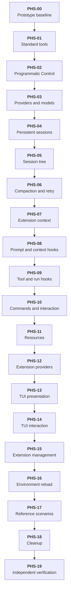

# Delivery Plan: Glyph Initial Product

This plan delivers the target behavior in [`prd.md`](prd.md) through sequential vertical slices starting from the implemented prototype in [`prototype-prd.md`](prototype-prd.md). Each product phase ends with a working scenario through public process contracts and a real client, provider, or extension process.

## Key definitions and abbreviations

- DEF-01: Vertical slice. A narrow, complete path through the affected public contract, Host use case, Agent Core behavior, process adapter, client or plugin, and automated tests.
- DEF-02: Programmatic Control. The transport-independent command and event contract defined by [`prd.md`](prd.md) for controlling a headless agent.
- DEF-03: Extension context. Host-provided access bound to one extension runtime and active session. A context becomes invalid after environment reload or session replacement.
- DEF-04: Reference extension. A small test or example extension that proves one public extension capability without adding suite-specific behavior to Agent Core.
- DEF-05: Product phase. A vertical slice that adds observable product behavior. PHS-00, PHS-18, and PHS-19 are verification or cleanup phases rather than product slices.
- DEF-06: Standard tool output budget. Model-visible text from a standard tool is limited to 50 KiB or 2,000 lines, whichever limit is reached first. A truncated result states why it was truncated and how the caller can retrieve the remaining information.

## Delivery Strategy

- DEC-01: Deliver phases in the order defined by the Phase Tree. A phase starts only after every incoming dependency has met its exit criteria.
- DEC-02: Add Programmatic Control before sessions and advanced extensions so later behavior is available without the standard TUI from its first phase.
- DEC-03: Add persistent sessions before stateful extension capabilities so extension state uses the final branch-aware session model.
- DEC-04: Add interface-neutral extension capabilities before standard-TUI-specific capabilities.
- DEC-05: Add environment reload after settings, providers, extension runtimes, resources, sessions, themes, and key bindings have stable owning use cases.
- DEC-06: Keep the repository runnable after every product phase. Do not merge public contract stubs that have no end-to-end consumer and implementation in the same phase.
- DEC-07: Use TDD for behavior changes. Each phase starts with tests for its stated exit criteria, implements the minimum behavior, then refactors while the focused tests remain green.
- DEC-08: Do not use feature flags. Each completed phase replaces the preceding product behavior and remains part of the next phase.
- DEC-09: No persistent-data migration is needed before PHS-04 because the prototype stores session history only in memory.

## Main Changes

- SOL-01: Complete the standard coding tool set and generalize the tool data model.
- SOL-02: Introduce correlated Programmatic Control alongside the existing UI plugin connection.
- SOL-03: Add selectable providers and models, persistent tree sessions, context compaction, and retry control.
- SOL-04: Extend the extension runtime with session-bound context, ordered Agent Core extension points, Host actions, commands, resources, providers, and inter-extension events.
- SOL-05: Expose standard-TUI-specific extension presentation and interaction without moving Agent Core behavior into the TUI process.
- SOL-06: Add extension installation, enablement, disablement, update, and environment reload.

## Entities and Invariants

- ENT-01: Agent run. At most one run is active per Host. Cancellation reaches the active provider request and active tool executions.
- ENT-02: Session. Entries form a persistent tree with one active leaf. Continuing from an earlier entry creates a branch and does not delete another branch.
- ENT-03: Extension runtime. One process owns its in-memory state. A runtime crash removes its capabilities and does not terminate Glyph.
- ENT-04: Extension context. The context is bound to one runtime generation and one active session. Calls through a stale context fail.
- ENT-05: Tool registry. Registered tools have deterministic ownership. The active set used by one model request does not change during that request.
- ENT-06: Extension point. Its contract declares whether handlers observe, block, modify, or replace an operation. Transformations run in registration order.
- ENT-07: Glyph client. A UI plugin or programmatic controller sends commands and receives correlated asynchronous events. Agent Core does not depend on either client kind.
- ENT-08: Resource contribution. Skills, prompt templates, and context files are collected by Host and processed outside Agent Core.
- ENT-09: Provider implementation. Authentication, model catalogue, request serialization, and streaming remain provider-owned.
- ENT-10: Standard TUI extension area. The extension owns area content and internal layout. The standard TUI retains terminal input dispatch, render scheduling, focus, and placement.
- ENT-11: Standard tool result. A result is bounded by DEF-06, distinguishes operation failure from truncation, and contains enough information to continue a partial read or locate complete command output.

## New Folders and Components

- CMP-01: Programmatic Control public contract and its Host controller under the existing public API and Host controller roots.
- CMP-02: Session domain, persistence adapter, and session use cases under [`host/internal`](../../../../host/internal).
- CMP-03: Compaction and retry use cases owned by Agent Core and Host according to their existing responsibilities.
- CMP-04: Extension context, extension-point dispatch, Host-action routing, command registry, resource registry, and provider registry under the existing Host layers.
- CMP-05: Standard TUI extension transport and presentation adapters under [`plugins/ui/tui`](../../../../plugins/ui/tui).
- CMP-06: Bundled resource extension as a sibling of the bundled tools extension under [`plugins/extension`](../../../../plugins/extension).
- CMP-07: Reference extensions and process-level contract fixtures in test or example locations selected by their owning SDK packages.

Exact package names and protobuf service boundaries are selected in the technical solution for each phase. New internal interfaces remain consumer-owned and transport DTOs remain outside domain and use-case packages.

## Backward Compatibility

No backward compatibility. Prototype-only internal APIs and protocol version 1 may be replaced when a phase introduces its target contract. Persistent session formats become product data when PHS-04 completes and must remain readable by all later phases in this plan.

## Phased Plan

### Phase Tree

### Decomposition Justification

- DEC-10: PHS-01 closes the standard coding-agent tool scenario before new control and persistence concerns are added. It upgrades the three prototype tools as well as adding the four missing tools.
- DEC-11: PHS-02 introduces one durable command and event path. PHS-03 through PHS-06 extend that path rather than creating feature-specific controller APIs.
- DEC-12: PHS-04 through PHS-06 separate persistence, branching, and compaction because each has a distinct user-visible scenario and failure model.
- DEC-13: PHS-07 introduces only the context and lifecycle required by later extension slices. PHS-08 through PHS-12 each prove one independent extension capability category with a reference extension.
- DEC-14: PHS-13 and PHS-14 separate passive presentation from focused interaction. This keeps each TUI protocol increment demonstrable without temporary UI behavior.
- DEC-15: PHS-15 precedes PHS-16 because reload must operate on the same installation and enablement state used at startup.
- DEC-16: PHS-17 tests the 20 reference scenarios after all capability categories exist. It does not port `pi-agent-suite` or add suite-specific Agent Core behavior.
- DEC-17: PHS-18 removes implementation residue before PHS-19 runs the independent final verification. No phase exists solely to add speculative abstractions.

## Overengineering and Overspecification Considerations

- TRD-01: Each public contract is introduced by a working scenario in the same phase. No universal extension service is planned in advance.
- TRD-02: The plan preserves the separation between Agent Core, Glyph Host, extension processes, UI plugins, and programmatic controllers defined by [`prd.md`](prd.md).
- TRD-03: Reference extensions prove generic contracts. They do not recreate `pi-agent-suite` packages or add first-class subagent, advisor, council, MCP, or workflow concepts.
- TRD-04: TUI-specific contracts remain owned by the standard TUI. Future UI plugins are not required to implement them.
- TRD-05: Performance targets, sandboxing, Windows, remote UI plugins, extension-defined startup arguments, and command argument completion remain outside this plan because [`prd.md`](prd.md) excludes them.

### Phase PHS-00 - Prototype baseline

#### Goal

Preserve an executable baseline before target behavior changes.

#### Work

- TSK-01: Add one process-level regression scenario covering Codex streaming, one extension tool call, standard TUI event delivery, and one-shot headless execution.
- TSK-02: Record the prototype limitations that each later phase removes by referencing [`prototype-technical-solution.md`](prototype-technical-solution.md).

#### Deliverables

- DLV-01: Automated baseline scenario using the existing extension and UI process contracts.

#### Exit criteria

- EXC-01: The baseline scenario passes through the standard TUI path and the headless path without changing product behavior.
- EXC-02: `task lint` and `task test` pass.

#### Risks

- RSK-01: A test tied to presentation text would obstruct later UI work. Verify semantic events and terminal outcomes instead of mutable text layout.

### Phase PHS-01 - Complete standard tools

#### Goal

Deliver bounded, production-usable `read`, `write`, `edit`, `grep`, `find`, `ls`, and `bash` behavior instead of only completing the tool-name catalogue.

#### Work

- TSK-03: Upgrade `read` from complete-file-only operation to offset and limit reads for text files, image results for supported image formats, and explicit continuation information when a result is partial.
- TSK-03.1: Add `write` with parent-directory creation and upgrade `edit` to apply one or more unique exact replacements as one file mutation. A missing or non-unique source fragment leaves the file unchanged.
- TSK-03.2: Add `grep`, `find`, and `ls` with the input and result controls in the Standard tool capability baseline below.
- TSK-03.3: Add `bash` timeout input, retain streamed stdout and stderr, terminate the process group on timeout or cancellation, and store complete output in a temporary file when the model-visible result exceeds DEF-06.
- TSK-04: Replace the prototype string-only schema profile with JSON-compatible tool arguments that support strings, numbers, booleans, null, arrays, nested objects, and optional fields.
- TSK-05: Apply DEF-06 to every textual standard-tool result while preserving Host schema validation, cancellation, and model-visible operation errors.

The Pi tool implementations in REF-12 through REF-19 provide evidence for the coding-agent capabilities in this baseline. They do not define Glyph API or source compatibility.

##### Standard tool capability baseline

| Tool | Required input and behavior | Partial or large result behavior |
|---|---|---|
| `read` | Required `path`; optional one-based `offset`; optional positive `limit`; text and supported image files | Text returns the requested line range and the next offset when more lines remain; DEF-06 still limits bytes; image content uses typed image result content |
| `write` | Required `path` and `content`; creates missing parent directories; replaces complete file content | Confirmation identifies the written path; content is not echoed beyond DEF-06 |
| `edit` | Required `path` and one or more ordered exact replacements; every source fragment must occur exactly once in the pre-mutation content | All replacements commit together; any invalid replacement returns an error and leaves the file unchanged |
| `grep` | Required pattern; optional path, glob, case-insensitive mode, literal mode, context lines, and positive match limit | Returns matching paths and lines, reports the reached match or output limit, and does not return unbounded lines |
| `find` | Required glob pattern; optional root path and positive result limit; returns project-relative paths | Reports the reached result or output limit |
| `ls` | Optional path and positive entry limit; marks directories distinctly | Reports the reached entry or output limit |
| `bash` | Required command; optional positive timeout with a defined maximum; streams stdout and stderr separately | Returns exit code and bounded output; a truncated result identifies the temporary file containing complete combined output |

#### Deliverables

- DLV-02: Bundled tools extension containing all seven standard tools with the capability baseline above.
- DLV-02.1: Shared standard-tool truncation metadata and temporary-output handling required by DEF-06.
- DLV-03: Public tool contract and Host runtime supporting typed text and image results and the required argument shapes.

#### Exit criteria

- EXC-03: Through the standard TUI, the agent can locate files, read them, update an existing file, create a file, run a command, and report the result.
- EXC-03.1: Reading with `offset` and `limit` returns exactly the requested available lines and identifies the next offset when more content remains.
- EXC-03.2: A multi-replacement edit changes the file once when every source fragment is unique and leaves the file byte-for-byte unchanged when any source fragment is missing or duplicated.
- EXC-03.3: `grep`, `find`, and `ls` apply every filter and limit listed in the capability baseline and report which limit truncated the result.
- EXC-03.4: No textual standard-tool result exceeds 50 KiB or 2,000 lines. A truncated `bash` result identifies a readable temporary file containing its complete output.
- EXC-03.5: `bash` timeout and cancellation terminate the command process group and return the distinct timeout or cancellation outcome.
- EXC-03.6: Reading a supported image returns typed image content without converting binary data to text.
- EXC-04: The same coding task completes through headless execution.
- EXC-05: Invalid arguments do not open an extension execution and produce a model-visible error.

#### Risks

- RSK-02: Provider schema and image capabilities differ. Keep the Host tool model provider-neutral and let each provider adapter reject an unsupported schema or image before dispatch.
- RSK-02.1: Reading or capturing complete files and command output can exhaust memory before result truncation. Implement bounded streaming or bounded accumulation at the filesystem and process adapters rather than truncating only after full buffering.
- RSK-02.2: Concurrent `write` and `edit` calls can lose updates after parallel tool batches are introduced in PHS-09. Route each complete read-modify-write operation through one absolute-path mutation queue before PHS-09 enables parallel execution.

### Phase PHS-02 - Programmatic Control foundation

#### Goal

Provide a long-lived headless client contract independent of the standard TUI.

#### Work

- TSK-06: Define correlated commands, acceptance or rejection responses, and asynchronous operation events.
- TSK-07: Implement user request, abort, run-state query, message query, and programmatic shell execution.
- TSK-08: Route commands through Host use cases rather than through UI-specific code.

#### Deliverables

- DLV-04: Public Programmatic Control contract with one supported transport.
- DLV-05: Programmatic controller process fixture or SDK client used by end-to-end tests.

#### Exit criteria

- EXC-06: A controller submits a request, receives acceptance before completion, correlates every resulting event, aborts an active run, and submits another request without restarting Host.
- EXC-07: Starting Programmatic Control does not load a UI plugin.

#### Risks

- RSK-03: A transport-shaped internal API would couple later features to one protocol. Controllers must map transport DTOs to consumer-owned Host commands and events.

### Phase PHS-03 - Providers, models, and runtime selection

#### Goal

Support the required built-in providers and model selection without ending the session.

#### Work

- TSK-09: Add the user-configured OpenAI-compatible provider with Chat Completions and Responses support.
- TSK-10: Replace the immutable startup model catalogue with configured provider and model catalogues.
- TSK-11: Add model and reasoning selection to Programmatic Control and the standard TUI.
- TSK-12: Resolve API keys through credential sources and keep secret values out of settings.

#### Deliverables

- DLV-06: OpenAI-compatible provider and configuration contract.
- DLV-07: Runtime model and reasoning selection through both client kinds.

#### Exit criteria

- EXC-08: A user selects a different configured model and the next request uses it without clearing conversation history.
- EXC-09: Failed credential resolution preserves the active model and returns an error before model execution.
- EXC-10: OpenAI-compatible operation without a credential source sends no authorization.

#### Risks

- RSK-04: Provider-specific fields could leak into Agent Core. Provider adapters must continue mapping through the provider-neutral model contract.

### Phase PHS-04 - Persistent linear sessions

#### Goal

Persist conversations and resume them after process restart.

#### Work

- TSK-13: Add persistent session storage for user messages, model responses, tool calls, tool results, provider context, and extension entry envelopes.
- TSK-14: Add session creation, resume, naming, information queries, entries queries, and statistics.
- TSK-15: Expose session operations through Programmatic Control and the standard TUI.

#### Deliverables

- DLV-08: Versioned persistent session format and storage adapter.
- DLV-09: Session selection and naming through both client kinds.

#### Exit criteria

- EXC-11: A user exits Glyph, resumes the saved session, and continues with the prior model and tool history available to the provider.
- EXC-12: Session entries preserve text, images, provider context, tool results, and model outcomes without provider DTOs in the session domain.

#### Risks

- RSK-05: Persisting streaming scratch state could make sessions unrecoverable. Persist only terminal entries and the terminal outcomes defined by Agent Core.

### Phase PHS-05 - Session tree

#### Goal

Support branch-preserving session navigation.

#### Work

- TSK-16: Add parent-child entry relations, active leaf, fork, clone, switch, tree navigation, labels, and session information.
- TSK-17: Add branch summaries with no summary, default summary, and custom-focus summary choices.
- TSK-18: Add complete tree presentation and navigation to the standard TUI and equivalent Programmatic Control commands.

#### Deliverables

- DLV-10: Persistent session tree and branch-summary model.
- DLV-11: Standard TUI session tree interaction.

#### Exit criteria

- EXC-13: Continuing from an earlier entry creates a new branch without deleting the previous branch.
- EXC-14: Selecting user or model-visible extension content places the expected text in the editor and moves the active leaf to the required parent.
- EXC-15: Labels and branch summaries survive restart.

#### Risks

- RSK-06: Tree operations can leave partial state after storage failure. Apply each navigation or branch operation atomically at the session-storage boundary.

### Phase PHS-06 - Context compaction and retry control

#### Goal

Keep long sessions usable within model context limits.

#### Work

- TSK-19: Add response-budget accounting and automatic compaction.
- TSK-20: Add manual compaction with user instructions and default summary behavior.
- TSK-21: Add retry control through Programmatic Control and the standard TUI.

#### Deliverables

- DLV-12: Compaction use case and persisted summary entries.
- DLV-13: Manual compaction and retry client operations.

#### Exit criteria

- EXC-16: Automatic compaction replaces an older context prefix, preserves the remaining suffix, and allows the run to continue.
- EXC-17: Manual compaction applies user instructions and persists the resulting summary.
- EXC-18: A compacted session resumes after restart with the same active branch.

#### Risks

- RSK-07: Provider token accounting may be absent or approximate. Define one Agent Core budget calculation based on the selected model descriptor and available usage data.

### Phase PHS-07 - Extension context and lifecycle

#### Goal

Give extension processes session-bound access and lifecycle events without terminal dependencies.

#### Work

- TSK-22: Add extension context identity, runtime generation, active session identity, cancellation, cwd, model catalogue inspection, and provider catalogue inspection.
- TSK-23: Deliver agent, turn, message, tool-execution, model-selection, and reasoning-selection events to registered extension handlers.
- TSK-24: Add model-hidden and model-visible branch-aware session entry operations.

#### Deliverables

- DLV-14: Public extension context and lifecycle contract.
- DLV-15: Reference extension that records lifecycle-derived branch state.

#### Exit criteria

- EXC-19: The reference extension works headlessly and through the standard TUI without changing its core behavior.
- EXC-20: Session replacement creates a new context and every operation through the preceding context fails.
- EXC-21: Extension entries attach to the active branch and survive restart.

#### Risks

- RSK-08: Long-lived requests could use a context after session replacement. Host validates runtime generation and session identity for every context operation.

### Phase PHS-08 - Prompt, context, input, and provider middleware

#### Goal

Allow extensions to change model-facing input through ordered generic extension points.

#### Work

- TSK-25: Add system-prompt changes, per-request context transformations, user text and image handling, finalized-message replacement, provider-header changes, serialized-request replacement, and provider-response observation.
- TSK-26: Apply transformations sequentially and pass each transformed value to the next handler.
- TSK-27: Continue later handlers and the core operation after an ordinary handler error while reporting that error.

#### Deliverables

- DLV-16: Public middleware contracts with declared observe, modify, replace, and handle semantics.
- DLV-17: Reference extensions for project instructions, context projection, and provider-request changes.

#### Exit criteria

- EXC-22: A project-instructions extension changes the effective system prompt in headless and TUI runs.
- EXC-23: A context transformation changes one outbound provider request without changing persisted session entries.
- EXC-24: An input handler can transform or fully handle text and image input.
- EXC-25: Two transforming handlers observe registration order, including when an earlier ordinary handler reports an error.

#### Risks

- RSK-09: Persisting transformed provider context would violate the request-local contract. Tests must compare persisted entries with the outbound provider request.

### Phase PHS-09 - Tool middleware and run control

#### Goal

Allow extensions to control tool policy and agent-run continuation.

#### Work

- TSK-28: Add pre-execution tool handlers for allow, reject, input modification, and handler-error blocking.
- TSK-29: Add sequential tool-result transformation, deterministic tool replacement, registered and active tool inspection, and active-set changes for subsequent model requests.
- TSK-30: Add parallel tool batches and the batch-wide `terminate` rule.
- TSK-31: Add `steer`, `followUp`, `nextTurn`, abort, and queue modes `all` and `one-at-a-time`.

#### Deliverables

- DLV-18: Tool middleware and active-tool contracts.
- DLV-19: Queued-message and termination behavior in Agent Core.
- DLV-20: Reference policy, tool-override, and terminating-output extensions.

#### Exit criteria

- EXC-26: A policy extension rejects one dangerous call, leaves the extension active, and lets the agent continue from the model-visible error result.
- EXC-27: An extension replaces one registered tool without disabling unrelated extensions.
- EXC-28: Active-tool changes affect the next model request and do not mutate a request already in progress.
- EXC-29: Agent Core skips the next automatic model request only when every completed result in the active batch has `terminate`.
- EXC-30: Queued messages follow their delivery points and selected queue mode.

#### Risks

- RSK-10: Concurrent tool completion can reorder persisted results. Execute concurrently while storing final tool-result messages in source-call order.

### Phase PHS-10 - Commands, interaction, notifications, and extension events

#### Goal

Let extensions expose user actions and request Host or client behavior.

#### Work

- TSK-32: Add command registration, discovery, invocation, and provenance through Glyph clients.
- TSK-33: Add interface-neutral interaction requests and notifications with explicit unavailable-client and delivery-failure results.
- TSK-34: Add non-persisted inter-extension events.
- TSK-35: Add configured-model requests for extension-owned behavior.

#### Deliverables

- DLV-21: Command registry and invocation contracts.
- DLV-22: Interaction, notification, extension-event, and configured-model request contracts.
- DLV-23: Reference command, interaction, notification, and model-query extensions.

#### Exit criteria

- EXC-31: The same extension command is discoverable and invokable through the standard TUI and Programmatic Control.
- EXC-32: An interaction request succeeds through either connected client kind and fails explicitly without a client.
- EXC-33: Notification success means Host transferred it to the client and does not require presentation or a user response.
- EXC-34: An extension model request uses a configured model without changing the active conversation model.

#### Risks

- RSK-11: A client disconnect can leave an extension request pending. Host completes every pending interaction with a delivery error when the client connection closes.

### Phase PHS-11 - Resource contributions

#### Goal

Collect extension-owned skills, prompt templates, and context files without adding resource concepts to Agent Core.

#### Work

- TSK-36: Add typed resource contribution collection at startup.
- TSK-37: Implement the bundled resource extension through the ordinary extension runtime.
- TSK-38: Convert skills and context files into resolved instructions and model context and expose prompt templates through Glyph clients.

#### Deliverables

- DLV-24: Resource contribution contract and Host registry.
- DLV-25: Bundled resource extension.

#### Exit criteria

- EXC-35: An extension contributes one skill, prompt template, and context file that are available through both client kinds.
- EXC-36: Agent Core receives only resolved instructions and context and imports no resource types.
- EXC-37: Recollecting one extension's resources replaces that extension's preceding contribution set.

#### Risks

- RSK-12: Resource paths can outlive the contributing runtime. Host snapshots or resolves contributions according to one ownership rule before publishing them.

### Phase PHS-12 - Extension-defined providers

#### Goal

Allow an installed extension to add and remove complete model provider implementations.

#### Work

- TSK-39: Add provider registration and removal with authentication, model catalogue, request serialization, and streamed responses.
- TSK-40: Expose generic credential storage and client interaction to provider implementations.
- TSK-41: Integrate registered providers with model selection, extension model requests, and provider middleware.

#### Deliverables

- DLV-26: Public extension-provider contract and SDK support.
- DLV-27: Reference provider extension with interactive authentication and streaming.

#### Exit criteria

- EXC-38: Installing the reference extension adds its models without changing or rebuilding Host.
- EXC-39: Authentication stores provider-owned opaque credentials through Host storage.
- EXC-40: Removing the provider preserves the active model when selection of a replacement model fails.

#### Risks

- RSK-13: Provider callbacks can expose credential contents to unrelated extensions. Credential operations remain scoped to the registered provider identity.

### Phase PHS-13 - Standard TUI presentation extensions

#### Goal

Let extensions add passive presentation to the standard TUI while the TUI retains terminal ownership.

#### Work

- TSK-42: Add statuses, working indicators, widgets, headers, footers, terminal title, and hidden-reasoning labels.
- TSK-43: Add renderers for tool calls, tool results, custom messages, and custom session entries.
- TSK-44: Add tool-result expansion inspection and updates.

#### Deliverables

- DLV-28: Standard TUI presentation-extension contract.
- DLV-29: Reference footer, status, widget, and renderer extensions.

#### Exit criteria

- EXC-41: Multiple extensions contribute passive presentation without taking terminal input or render-loop ownership.
- EXC-42: The standard TUI removes an extension's presentation when its runtime becomes unavailable.
- EXC-43: Using the same extension headlessly keeps core behavior active and returns explicit errors for attempted TUI-only operations.

#### Risks

- RSK-14: Frequent extension updates can stall rendering. The TUI owns update scheduling and applies bounded presentation messages without granting render-loop control.

### Phase PHS-14 - Interactive standard TUI extensions

#### Goal

Support focused extension interaction and editor integration inside the standard TUI.

#### Work

- TSK-45: Add custom areas, overlays, focus, and forwarded terminal input.
- TSK-46: Add editor text read, replace, insert, autocomplete contribution, and editor component replacement.
- TSK-47: Add theme contribution, enumeration, switching, and configurable TUI-specific shortcuts.

#### Deliverables

- DLV-30: Interactive TUI extension contract.
- DLV-31: Reference structured-input, overlay, editor, theme, and shortcut extensions.

#### Exit criteria

- EXC-44: An extension displays an overlay, receives input only while focused, and returns control to the standard TUI.
- EXC-45: An extension reads and changes editor text without owning terminal input outside its active interaction.
- EXC-46: Contributed themes and shortcuts use the same user configuration rules as built-in TUI actions.

#### Risks

- RSK-15: An extension component can fail while focused. The standard TUI must reclaim focus, remove the failed area, and remain usable.

### Phase PHS-15 - Extension installation and state management

#### Goal

Manage compatible extensions without rebuilding Glyph.

#### Work

- TSK-48: Add installation, enablement, disablement, and update operations for compatible extension packages.
- TSK-49: Store configured extension state separately from discovered runtime state.
- TSK-50: Move bundled tools and bundled resource processing under the same lifecycle rules as other extensions.

#### Deliverables

- DLV-32: Extension package lifecycle and persistent enablement state.
- DLV-33: Bundled extensions represented through the ordinary extension catalogue.

#### Exit criteria

- EXC-47: A user installs, enables, disables, updates, and removes an extension without rebuilding Host.
- EXC-48: The bundled tools and resource extensions can be disabled, updated, and replaced through the same operations.
- EXC-49: An incompatible package never starts and does not affect compatible extensions.

#### Risks

- RSK-16: Updating a running executable can produce mixed runtime state. Package mutation changes configured state only; PHS-16 applies runtime changes through environment reload.

### Phase PHS-16 - Environment reload

#### Goal

Apply environment changes without ending the active session.

#### Work

- TSK-51: Add a quiescence check that rejects reload during an agent run or compaction.
- TSK-52: Reload Host settings except active UI selection, provider registrations, extension runtimes, and resource contributions.
- TSK-53: Reload standard TUI themes and key bindings while retaining the selected UI plugin.
- TSK-54: Invalidate preceding extension contexts and bind later events and commands to the replacement runtimes and active session.

#### Deliverables

- DLV-34: Environment reload use case exposed through the standard TUI and Programmatic Control.

#### Exit criteria

- EXC-50: Reload preserves the active session and history while applying changed settings, providers, extensions, and resources.
- EXC-51: Reload while a run or compaction is active is rejected with a warning and changes no environment state.
- EXC-52: Failed reinitialization preserves the session, reports the error, requires restart, and does not restore the preceding environment.
- EXC-53: Every operation through a context created before reload fails.

#### Risks

- RSK-17: Partial replacement can combine old and new environment state. Build the replacement environment separately, switch ownership once, and follow the PRD failure rule instead of restoring the old environment.

### Phase PHS-17 - Reference scenario closure

#### Goal

Demonstrate that generic Glyph contracts cover all 20 reference entry points listed in [`prd.md`](prd.md).

#### Work

- TSK-55: Create one generic reference extension fixture for each distinct capability combination needed by the Reference Scenario Coverage matrix.
- TSK-56: Run every non-terminal scenario through Programmatic Control and every terminal scenario through the standard TUI.
- TSK-57: Confirm that no fixture requires a suite-specific Agent Core concept or imports another project's internal package.

#### Deliverables

- DLV-35: Automated reference-scenario suite linked to the 20-entry coverage matrix.

#### Exit criteria

- EXC-54: Every Reference Scenario Coverage row has at least one passing process-level scenario through public contracts.
- EXC-55: Headless-capable fixtures run without loading the standard TUI.
- EXC-56: TUI-only calls fail explicitly when no standard TUI capability is active.

#### Risks

- RSK-18: Fixtures can accidentally become ports of `pi-agent-suite`. Keep fixtures minimal and assert generic observable behavior rather than package-specific output.

### Phase PHS-18 - Cleanup

#### Goal

Remove prototype-only restrictions and implementation residue superseded by target behavior.

#### Work

- TSK-58: Remove unused prototype schema restrictions, startup-only catalog paths, one-shot-only control paths, dead contract versions, temporary adapters, debugging artifacts, and obsolete test fixtures.
- TSK-59: Align public documentation and SDK examples with the contracts exercised by PHS-17.
- TSK-60: Confirm that no Agent Core package depends on protobuf, gRPC, plugin SDKs, persistence adapters, or TUI packages.

#### Deliverables

- DLV-36: Product code and documentation without superseded prototype paths.

#### Exit criteria

- EXC-57: Repository search finds no referenced prototype-only implementation path that was replaced by PHS-01 through PHS-17.
- EXC-58: Public SDK examples compile against the final public contracts.
- EXC-59: `task lint` and `task test` pass after cleanup.

#### Risks

- RSK-19: Cleanup can remove a still-used compatibility path. Remove code only after symbolic reference search and focused regression tests show no remaining owner.

### Phase PHS-19 - Independent final verification

#### Goal

Verify the complete PRD through public behavior after cleanup.

#### Work

- TSK-61: Run the full unit, integration, contract, and process-level suites on macOS and Linux.
- TSK-62: Execute the standard coding-agent scenario through the standard TUI and Programmatic Control.
- TSK-63: Audit every normative requirement in [`prd.md`](prd.md) against a passing test or an observable packaging or licensing artifact.

#### Deliverables

- DLV-37: Final requirement-to-evidence matrix and platform test results.

#### Exit criteria

- EXC-60: Every in-scope functional requirement has passing evidence through its owning public or internal contract.
- EXC-61: macOS and Linux builds execute the standard coding-agent, extension, provider, session, reload, TUI, and Programmatic Control scenarios.
- EXC-62: `task lint` and `task test` pass from a clean repository checkout.

#### Risks

- RSK-20: Platform-specific process or terminal behavior can fail only on one operating system. Run process and TUI lifecycle tests on both required platforms rather than relying on cross-compilation.

## Test Strategy

- CHK-01: Unit tests cover Agent Core state transitions, session-tree rules, compaction, queue delivery, extension-point ordering, stale-context rejection, and TUI presentation reducers.
- CHK-02: Contract tests start real extension, UI, provider, and Programmatic Control processes through public SDKs and generated contracts.
- CHK-03: Integration tests cover Host orchestration with generated consumer-owned mocks at infrastructure boundaries.
- CHK-04: Process-level tests cover one complete scenario for every product phase and the final 20-row reference matrix.
- CHK-05: Persistence tests restart Host and verify sessions, branches, labels, summaries, credentials, settings, and extension enablement through public use cases.
- CHK-06: Cancellation tests cover model streaming, parallel tools, interaction requests, compaction, UI termination, and Host shutdown.
- CHK-07: Security tests cover owner-only credential storage, absence of secrets in settings and extension environments, and provider-scoped credential access.
- CHK-08: Every coding phase runs focused tests during RED and GREEN, then runs `task lint` and `task test` before completion.
- CHK-09: Standard-tool tests cover partial reads, image reads, output budgets, truncation continuation, batch edit atomicity, parent-directory creation, search filters and limits, command timeout, cancellation, and complete-output file handling.

## Dependencies and Resourcing

- DEP-01: Go 1.26 and the dependencies already declared by the repository remain the implementation baseline.
- DEP-02: A provider test endpoint or deterministic local protocol fixture is required for OpenAI-compatible and extension-provider contract tests.
- DEP-03: macOS and Linux execution environments are required for PHS-19. Cross-compilation is insufficient for process, terminal, and filesystem behavior.
- DEP-04: Public protobuf changes require regenerated code under [`pkg/plugins`](../../../../pkg/plugins) and matching SDK contract tests under [`sdk/plugins`](../../../../sdk/plugins).
- DEP-05: PHS-13 and PHS-14 depend on the standard TUI remaining the active UI plugin for their terminal-specific scenarios.

## Project Definition of Done

- DOD-01: All normative requirements in [`prd.md`](prd.md) have passing evidence recorded by PHS-19.
- DOD-02: Agent Core runs without importing or loading a UI plugin.
- DOD-03: Every non-terminal extension capability used by the reference scenarios works through Programmatic Control.
- DOD-04: Extension, UI, provider, and Programmatic Control contracts have process-level contract tests.
- DOD-05: Persistent sessions survive restart and preserve tree, provider context, compaction summaries, labels, and extension entries.
- DOD-06: Extension installation, update, enablement, disablement, crash isolation, and environment reload follow the PRD outcomes.
- DOD-07: Standard TUI presentation and interaction extensions cannot take ownership of the terminal render loop or Agent Core behavior.
- DOD-08: macOS and Linux pass the final process-level suite.
- DOD-09: Public documentation, examples, and generated contracts match the final SDK behavior.
- DOD-10: `task lint` and `task test` pass.
- DOD-11: All seven bundled standard tools satisfy the PHS-01 capability baseline and never place unbounded text into model context.

## Assumptions

- ASM-01: The prototype is the starting implementation. Justification: [`prototype-technical-solution.md`](prototype-technical-solution.md) describes the code structure present in the repository. Verification: PHS-00 baseline tests exercise that structure before target changes.
- ASM-02: Prototype session history has no supported persistent format. Justification: the prototype stores one in-memory linear history. Verification: PHS-04 repository inspection precedes creation of the persistent format.
- ASM-03: One supported transport is sufficient to prove Programmatic Control while its application contract remains transport-independent. Justification: [`prd.md`](prd.md) requires transport independence, not multiple transports. Verification: PHS-02 keeps transport DTOs in the controller layer.
- ASM-04: The 20-entry Reference Scenario Coverage matrix is the acceptance set for Pi-comparable extension capability. Justification: [`prd.md`](prd.md) names that matrix as traceability for current `pi-agent-suite` entry points. Verification: PHS-17 links each row to a process-level scenario.

## Open Questions

None.

## Standards Deviations

None.

## References

- REF-01: [`prd.md`](prd.md) - target product requirements and reference scenario coverage.
- REF-02: [`prototype-prd.md`](prototype-prd.md) - implemented prototype scope.
- REF-03: [`prototype-technical-solution.md`](prototype-technical-solution.md) - prototype architecture and accepted implementation decisions.
- REF-04: [`tool.proto`](../../../../api/plugins/extension/v1/tool.proto) - current extension tool process contract.
- REF-05: [`ui.proto`](../../../../api/plugins/ui/v1/ui.proto) - current UI plugin process contract.
- REF-06: [`pi-extension-surface.md`](../../../artefacts/pi-extension-surface.md) - researched extension capability surface and production-suite usage.
- REF-07: [`go-extension-feasibility.md`](../../../artefacts/go-extension-feasibility.md) - rationale for separately built extension processes.
- REF-08: [`terms.md`](../../../terms.md) - project terminology.
- REF-09: [`pi-agent-suite`](https://github.com/n-r-w/pi-agent-suite) - reference extension scenarios named by the target PRD.
- REF-10: [`read` use case](../../../../plugins/extension/tools/internal/usecase/tools/read/service.go) - current complete-file-only Glyph read behavior.
- REF-11: [`tools extension controller`](../../../../plugins/extension/tools/internal/controller/extension/service.go) - current `read`, `edit`, and `bash` argument and result mapping.
- REF-12: [`read.ts`](https://github.com/badlogic/pi-mono/blob/main/packages/coding-agent/src/core/tools/read.ts) - reference offset, limit, image, and truncation behavior.
- REF-13: [`write.ts`](https://github.com/badlogic/pi-mono/blob/main/packages/coding-agent/src/core/tools/write.ts) - reference complete-file write and parent-directory behavior.
- REF-14: [`edit.ts`](https://github.com/badlogic/pi-mono/blob/main/packages/coding-agent/src/core/tools/edit.ts) - reference ordered multi-replacement behavior.
- REF-15: [`grep.ts`](https://github.com/badlogic/pi-mono/blob/main/packages/coding-agent/src/core/tools/grep.ts) - reference search filters, context, and result limits.
- REF-16: [`find.ts`](https://github.com/badlogic/pi-mono/blob/main/packages/coding-agent/src/core/tools/find.ts) - reference file discovery and result limits.
- REF-17: [`ls.ts`](https://github.com/badlogic/pi-mono/blob/main/packages/coding-agent/src/core/tools/ls.ts) - reference directory listing and entry limits.
- REF-18: [`bash.ts`](https://github.com/badlogic/pi-mono/blob/main/packages/coding-agent/src/core/tools/bash.ts) - reference timeout, streaming, cancellation, and complete-output handling.
- REF-19: [`truncate.ts`](https://github.com/badlogic/pi-mono/blob/main/packages/coding-agent/src/core/tools/truncate.ts) - reference 50 KiB and 2,000-line output budgets.
