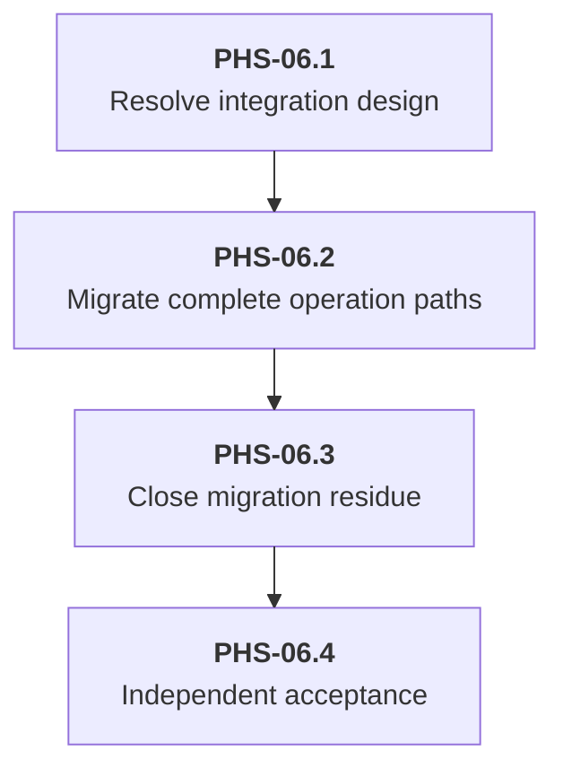

# Delivery Plan: PHS-06 extension-owned compaction migration

Status: Planned. Start with PHS-06.1. Production migration has not started.

Move compaction policy and composition from Host into an extension while retaining the durable history-replacement mechanism. This plan is the continuation path after checkpoint `690827f`. The old implementation order in the [checkpoint design](solution.md#unaccepted-checkpoint-design) is not the migration plan.

## Key definitions and abbreviations

- Compaction policy: decisions about triggering, sizing, retained boundaries, generation, and compaction-specific overflow handling.
- Compaction composition: ordered request/result transformations with immutable original values and composed current values.
- Prepared history: the model-facing history after session projection, including the latest applicable replacement entry and its retained suffix.
- Checkpoint: commit `690827f`, which preserves the unaccepted Host-owned implementation and the approved ownership requirements.

The [ticket](ticket.md#key-definitions-and-abbreviations) owns the detailed definitions and requirements.

## Delivery Strategy

### Resume point

- The working baseline is checkpoint `690827f`. It passed generation stability, formatting, fix dry-run, lint, unit tests, integration tests, coverage, build, package loading, and diff checks. Coverage was 83.2%. These checks did not establish phase acceptance.
- Units 0 through 3 and the session-entry/projection foundation are implemented. The Host-owned unit 4 implementation is unaccepted. The bundled compaction extension is not implemented.
- The next deliverable is the target integration design in [solution.md](solution.md#proposed-solution), resolving [QST-01](ticket.md#qst-01-minimal-compaction-integration-contract). Do not continue the old unit 5 as a generator-only addition to Host policy.
- After each completed migration phase, record its result, evidence, remaining blockers, and commit in this plan. The first phase without completed exit criteria is the resume point.

### Work boundaries

Preserve the approved [target ownership](solution.md#target-ownership) and the ticket's composition behavior. This work does not redesign ordinary retries, providers, tools, or branch summarization. The [production panic elimination issue](../../../../issues/production-panic-elimination/ticket.md) remains a separate task; this migration is not its remediation pass.

Retain the checkpoint's [open findings and accepted narrow test-first deviation](solution.md#implementation-evidence) as evidence, not as target behavior. Resolve the result-candidate and coherent-snapshot defects in the target paths that replace those responsibilities. Remove obsolete paths instead of repairing them solely to preserve the rejected architecture.

## Main Changes

- Move trigger decisions, sizing and usage-baseline policy, retained-boundary selection, request/result composition, summary generation, and compaction-specific overflow decisions into the extension.
- Connect manual commands, pre-request preparation, and overflow handling to that policy through the minimal agreed integration contract.
- Keep session-bound access, structural validation, atomic history mutation, projection, publication, and accounting with their Host/session owners.
- Delete superseded Host policy and its obsolete contracts in the migration, without a forwarding layer or fallback implementation.

## Entities and Invariants

- A replacement entry changes model-visible context, not stored original history. Repeated compaction, restart, navigation, fork, and clone retain the ticket's projection behavior.
- Session identity, active-branch membership, source accounting, and tool-call/result integrity remain mutation invariants enforced by the session owner.
- Agent Core receives prepared history and has no compaction policy or compaction-specific orchestration.
- Ordered composition, generation bypass for a supplied result, explicit cancellation, complete error causes, and committed outcomes remain observable behavior.
- Ordinary retry allowance and completed-tool execution are preserved. Compaction-specific recovery must not create an independent retry budget.

The [ticket requirements and acceptance criteria](ticket.md#requirements) define these invariants; this plan does not add another policy specification.

## New Folders and Components

The bundled compaction extension is the required runtime addition. Its package layout and the minimal integration contract are outputs of PHS-06.1, not assumptions in this plan. No new Host compaction-policy service, shared-contract namespace, or general middleware platform is planned.

The checkpoint's [Host compaction implementation](../../../../../../host/internal/usecase/host/contextcompaction), [model execution](../../../../../../host/internal/usecase/host/modelexecution), [session owner](../../../../../../host/internal/usecase/host/sessions), and [Extension SDK](../../../../../../sdk/plugins/extension/v1) are the starting points for the ownership map. Their present API shapes do not constrain the target contract.

## Backward Compatibility

No backward compatibility. Replace affected internal and public contracts with their callers in the same migration. Do not retain aliases, forwarding facades, alternate Host policy, or a fallback generator to keep the checkpoint API alive.

## Phased Plan

### Phase Tree

The phases are sequential. Their identifiers are subphases of product phase PHS-06.

### Decomposition Justification

Design precedes production changes because the extension-to-Host integration is unresolved. Policy transfer, extension connection, caller migration, and removal of replaced Host behavior belong to one implementation phase; separating them into accepted layers would leave two policies or a disconnected extension. PHS-06.1 defines the concrete vertical work slices within PHS-06.2 after the contract is known. Cleanup and independent verification are separate acceptance gates, not permission to keep a compatibility path until the end.

Tests exercise history changes and public operation outcomes. There are no tests whose only purpose is to count new types, assert deleted functionality is absent, or compare mutable prompts.

## Overengineering and Overspecification Considerations

Reuse session history and extension runtime mechanisms. Determine only the integration needed by the approved manual, automatic, and overflow paths. Do not invent API names, additional components, feature flags, or a generic framework before PHS-06.1 establishes a concrete need.

### Phase PHS-06.1 - Resolve and agree the integration design

#### Goal

Close the owning ticket's QST-01 without adding compaction knowledge to Agent Core or a second policy owner in Host.

#### Work

- Trace the checkpoint entry points, session snapshots and mutations, model access, usage observations, cancellation, retry decisions, and extension invocation.
- Define how the policy-owning extension receives coherent inputs, invokes participating request/generator/result capabilities, and requests one durable replacement entry.
- Define manual, pre-request, and overflow call flows, including nested summary-model calls, terminal errors, cancellation, and committed-result publication.
- Map responsibilities and imports. Identify checkpoint behavior to retain, move, replace, or delete. Keep provider-private payloads outside non-provider extension data.
- Record the target contract in the technical solution and obtain approval before production migration. Refine PHS-06.2 into end-to-end work slices using that contract, not speculative APIs.

#### Deliverables

An updated technical solution, an acyclic ownership/dependency map, and concrete implementation slices with behavioral test scenarios.

#### Exit criteria

QST-01 has an agreed answer. Every manual, automatic, and overflow path has a named owner, required inputs, cancellation/error outcome, and persistence boundary. Composition requirements are preserved. The design contains no duplicate Host compaction policy or workaround for an import cycle.

#### Risks

Moving only generation would reproduce the checkpoint architecture. Validate the ownership of every policy decision, not only the prompt location.

### Phase PHS-06.2 - Migrate complete operation paths

#### Goal

Execute real compaction through the extension and leave no active Host policy path.

#### Work

- For each agreed vertical slice, write compiling behavioral regressions and run them uncached to establish RED. Implement the target behavior, obtain GREEN, and then refactor.
- Implement extension-owned policy and summary generation through the ordinary runtime and configured-model access. Preserve the approved handling of preceding summaries, images, usage, and result source.
- Wire manual UI, Programmatic, and session-bound Extension operations, automatic context preparation, and overflow recovery to the extension-owned path.
- Apply the extension-selected replacement through the session owner and observe prepared history on the next real model request.
- Remove the replaced Host sizing, boundary, composition, generation-dispatch, and compaction-specific recovery behavior together with its migrated callers. Preserve ordinary retry semantics.
- Address the checkpoint's open result-candidate and snapshot findings in the target implementation. Preserve last valid composed state and one coherent operation snapshot.

#### Deliverables

A bundled extension invoked through its public contract, migrated operation paths, removal of replaced Host policy, and uncached behavioral/integration evidence for those paths.

#### Exit criteria

The bundled extension works in the standard coding-agent assembly. Manual, automatic, and overflow entry points use the extension-owned policy. Original history remains durable and model requests use the replacement summary plus retained suffix. Required composition and custom complete replacement work through public contracts. Host and Agent Core do not execute an alternate compaction algorithm.

#### Risks

Mocked capability fixtures can conceal an unwired real extension. Include production runtime, SDK, session, and model-execution paths rather than treating mock-backed transport tests as full assembly evidence.

### Phase PHS-06.3 - Close migration residue and documentation

#### Goal

Leave one target implementation and documentation that describes it.

#### Work

- Inspect the migrated call graph for obsolete Host policy, unused contracts, duplicate estimators, forwarding wrappers, and compatibility aliases. Remove residue not already removed with its callers.
- Regenerate public contracts and mocks. Correct the projected-session-entry description and other contract comments whose scope changed.
- Update the technical solution and phase status to separate target behavior from checkpoint evidence. Keep unresolved findings open instead of marking the phase complete because checks pass.
- Run the project's mandatory generation, formatting, fix, lint, unit, integration, coverage, build, package, and diff checks.

#### Deliverables

One implementation path, matching generated artifacts, accurate documentation, and full verification results.

#### Exit criteria

No superseded Host policy or compatibility path remains. Generation is stable on the second run. Required checks pass. Tests and documentation refer to the target boundary, and the working changes are ready for independent review.

#### Risks

Cleanup can become unrelated refactoring. Limit it to migration residue; keep the separate panic issue outside this phase.

### Phase PHS-06.4 - Independent acceptance

#### Goal

Accept PHS-06 against the approved requirements and actual user-facing behavior.

#### Work

- Independently review the complete migration diff against checkpoint `690827f`, the ticket, and the target technical solution.
- Exercise the bundled extension and a custom complete replacement through real public boundaries. Cover manual, automatic, overflow, repeated compaction, restart/navigation, cancellation, and post-commit failures.
- Distinguish production assembly evidence from mocked ports and report platform skips explicitly. Reject unsupported findings by checking the actual path and its called helpers.
- Correct supported defects with test-first evidence and repeat the complete review. Record the accepted result and commit before marking PHS-06 complete.

#### Deliverables

Independent review results, assembled-path evidence, and an accurate phase-completion record.

#### Exit criteria

All ticket acceptance criteria have executable evidence. No unapproved blocker or major finding remains. The full verification suite passes and the roadmap reflects completed target behavior rather than the checkpoint.

#### Risks

Earlier green checks did not prove correctness or architectural acceptance. Base closure on the implemented ownership and observable outcomes as well as command results.

## Test Strategy

Use compiling uncached RED/GREEN for behavior changes. Behavior-preserving moves and documentation changes do not require artificial RED evidence. Preserve session/projection regression coverage and add boundary tests for coherent snapshots, validated candidate installation, cancellation ownership, and committed outcomes where the target implementation needs them.

Use integration-tagged tests for assembled production components and real filesystem, process, transport, or terminal paths. Do not test logs or prompt wording. Compare generation twice and complete the mandatory project checks before implementation acceptance. The accepted checkpoint TDD exception is historical and does not waive test-first work in this migration.

## Dependencies and Resourcing

PHS-07 and PHS-04.1 are the ticket dependencies. The immediate blocker is QST-01, not the absence of the old generator-only unit 5. The plan assumes no new dependency, staffing, or external service. Further implementation depends on the agreed design from PHS-06.1.

## Project Definition of Done

The extension owns compaction policy and composition; session services preserve and project replacement entries; Agent Core consumes prepared history without compaction knowledge. All required public flows and composition behaviors pass their acceptance checks, replaced Host policy is removed, independent review is complete, and the solution and roadmap record the result.

## Assumptions

No additional product behavior or integration API is assumed. Checkpoint `690827f` is a comparison baseline, not an accepted target implementation.

## Open Questions

The owning [QST-01](ticket.md#qst-01-minimal-compaction-integration-contract) blocks PHS-06.2. PHS-06.1 resolves it in the technical solution. This plan does not create a second version of that question or settle its API prematurely.

## Standards Deviations

No new deviation is authorized. The narrowly accepted checkpoint test-first deviation remains documented in [implementation evidence](solution.md#implementation-evidence) and is not migration evidence.

## References

- [PHS-06 ticket](ticket.md) - requirements, acceptance criteria, and QST-01.
- [Target solution](solution.md#proposed-solution) - approved ownership and pending integration design.
- [Checkpoint evidence](solution.md#implementation-evidence) - implemented units, open findings, and process exception.
- [Target architecture](../../architecture.md) - Agent Core, Host, extension, and session boundaries.
- [Product delivery plan](../../delivery-plan.md) and [roadmap](../../../../../roadmap.md) - product ordering and phase status.
